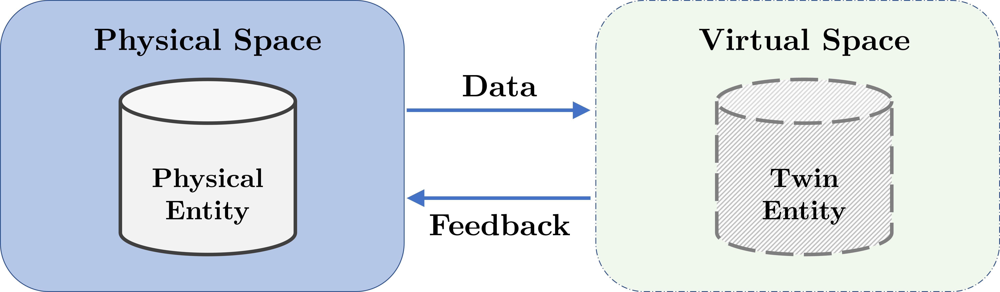
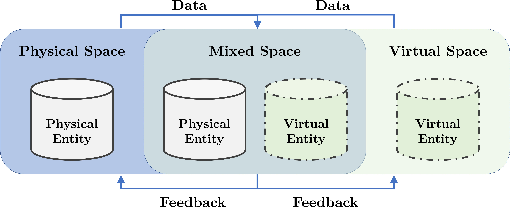
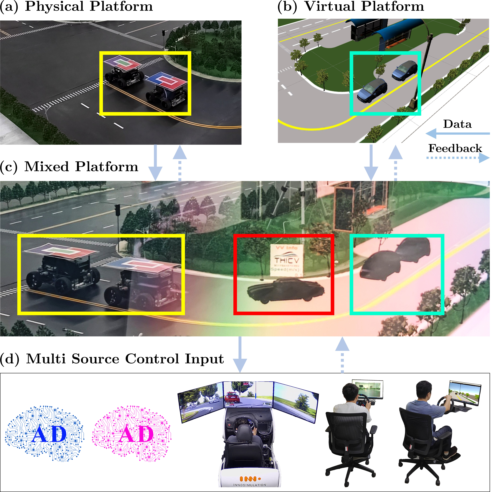
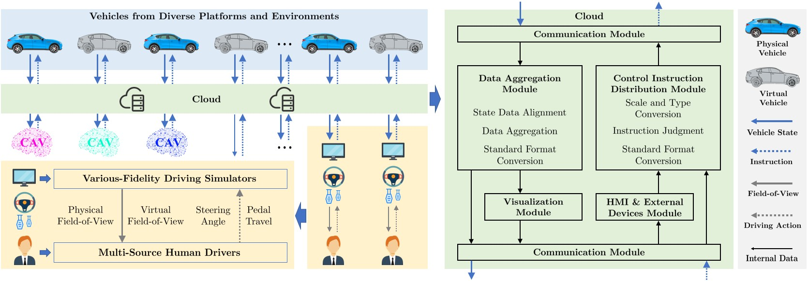
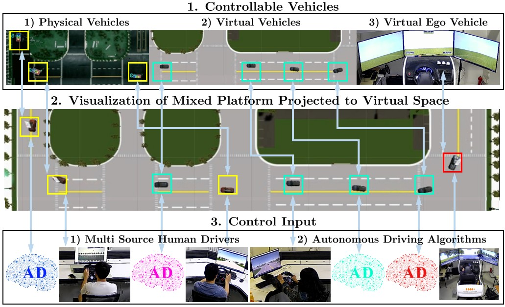
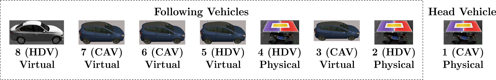

# Multi Source Human-in-the-loop Mixed Cloud Control Testbed (MSH-MCCT)

<!--课题组网站链接-->
[](https://www.labxing.com/thicv)

In this project, we present demo videos for our Connected and Autonomous Vehicles (CAVs) testing platform, Multi Source Human-in-the-loop Mixed Cloud Control Testbed (MSH-MCCT), developed based on a new notion of Mixed Digital Twin (mixedDT). 

## The notion of mixedDT
By introducing Mixed Reality into classical DT, mixedDT bridges the physical and virtual spaces into an unified, integrated one, where physical entities coexist and interact with virtual entities via their digital counterparts. 

The schematic diagram of the classical DT is as follows.



The schematic diagram of the proposed mixedDT is as follows.



## The structure of the MSH-MCCT

Under the framework of mixedDT, MSH-MCCT contains physical and virtual platform, multi source control input and mixed platform. 

An corresponding overview of the MSH-MCCT is as follows.



The methodological framework diagram for conducting multi-source human-in-the-loop CAVs testing in MSH-MCCT is as follows.



## Demo videos
Two multi-source human-in-the-loop CAVs testing experiments are carried out on vehicle platooning, which is composed of different types of vehicles from different platforms in MSH-MCCT.

The detailed schematic diagram of the two experiments is illustrated below.

Bridged by the mixed platform, human drivers and autonomous driving algorithms could control both physical and virtual vehicles. Therefore, physical and virtual CAVs and HDVs could coexist and interact simultaneously within the same integrated environment, greatly enhancing the flexibility and scalability of experiments. 



The formation of the platoon for experiment A and B is shown below.



**Experiment A:** Head vehicle encounters a sinusoidal disturbance.

The video of the experiment process is shown below. The Video plays at 1.6x speed.


**Experiment B:** Head vehicle encounters a step disturbance, simulating a sudden braking scenario.

The video of the experiment process is shown below.


<!--还没放上去，先不放
More longer videos can be found on [](https://github.com/cmc623/Formation-control-experiments).
-->

## More experiments on MSH-MCCT
- Multi-vehicle coordinated formation control. [](https://github.com/cmc623/Formation-control-experiments)
- Data-Enabled Predictive Leading Cruise Control (DeeP-LCC). [](https://github.com/soc-ucsd/DeeP-LCC)

## Related publications
1. Yang C, Dong J, Xu Q, et al. Multi-vehicle experiment platform: A Digital Twin Realization Method[C]//2022 IEEE/SICE International Symposium on System Integration (SII). IEEE, 2022: 705-711. [paper link](https://www.researchgate.net/publication/359072029_Multi-vehicle_experiment_platform_A_Digital_Twin_Realization_Method)
2. Cai M, Xu Q, Yang C, et al. Experimental Validation of Multi-lane Formation Control for Connected and Automated Vehicles in Multiple Scenarios[J]. arXiv preprint arXiv:2112.00312, 2021. [paper link](https://www.researchgate.net/publication/356711150_Experimental_Validation_of_Multi-lane_Formation_Control_for_Connected_and_Automated_Vehicles_in_Multiple_Scenarios)
3. Wang J, Zheng Y, Dong J, et al. Experimental Validation of DeeP-LCC for Dissipating Stop-and-Go Waves in Mixed Traffic[J]. arXiv preprint arXiv:2204.03747, 2022. [paper link](https://arxiv.org/abs/2204.03747)
4. Dong J, Xu Q, Wang J, et al. Mixed cloud control testbed: Validating vehicle-road-cloud integration via mixed digital twin[J]. IEEE Transactions on Intelligent Vehicles, 2023. [paper link](https://arxiv.org/abs/2212.02007)
5. Wang J, Zheng Y, Dong J, et al. Implementation and experimental validation of data-driven predictive control for dissipating stop-and-go waves in mixed traffic[J]. IEEE Internet of Things Journal, 2023. [paper link](https://arxiv.org/abs/2204.03747)
6. 
## Citing MSH-MCCT
If you refer to MSH-MCCT in your research, please cite the [paper](https://arxiv.org/abs/2212.02007). In BibTeX format:

```bibtex
@article{dong2023mixed,
  title={Mixed cloud control testbed: Validating vehicle-road-cloud integration via mixed digital twin},
  author={Dong, Jianghong and Xu, Qing and Wang, Jiawei and Yang, Chunying and Cai, Mengchi and Chen, Chaoyi and Liu, Yu and Wang, Jianqiang and Li, Keqiang},
  journal={IEEE Transactions on Intelligent Vehicles},
  year={2023},
  publisher={IEEE}
}
```

## Contacts
For more details, please contact [Jianghong Dong](https://www.researchgate.net/profile/Jianghong-Dong) and [Jiawei Wang](https://wjiawei.com/).

